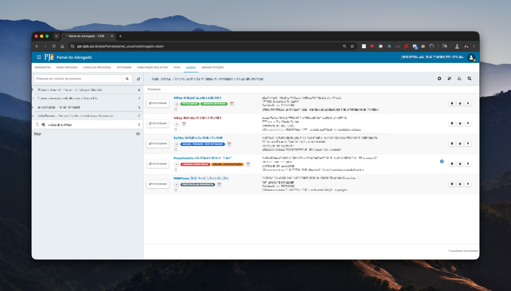
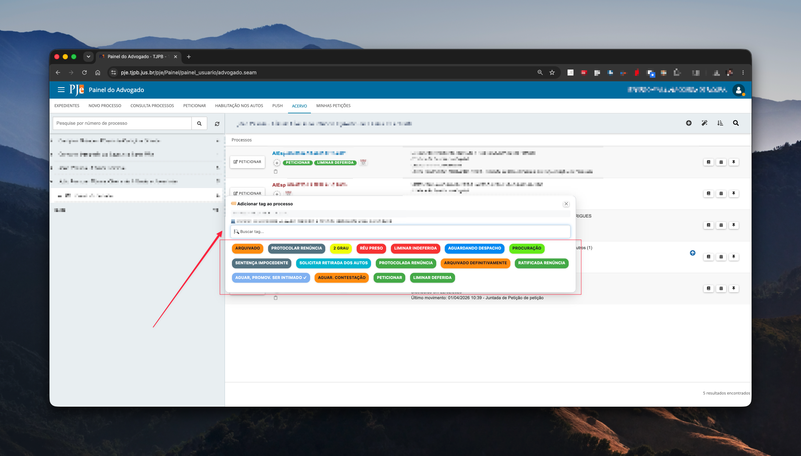
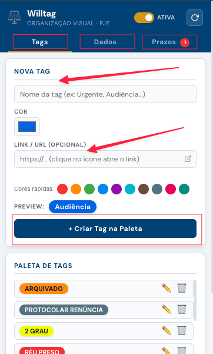

# ⚖️ Willtag — Organização Visual para o PJe

> Extensão para Google Chrome que permite organizar processos do PJe (TJPB) com **tags visuais coloridas**, contadores de prazo e anotações — tudo armazenado **localmente no seu computador**, sem coleta de dados ou servidores externos.

---

## 📸 Screenshots

<div align="center">

### Painel do Advogado — Tags aplicadas nos processos


<br>

### Adicionando uma tag a um processo


<br>

### Interface da extensão — Criando uma nova tag


</div>

---

## 📌 O que é o Willtag?

O **Willtag** é uma extensão desenvolvida para advogados que utilizam o sistema **PJe do TJPB** (1º e 2º grau). Ela injeta etiquetas visuais (tags) diretamente nas listas de processos e nas páginas de autos, permitindo identificar rapidamente o status de cada processo com cores e rótulos personalizados.

**Não há cadastro, login ou envio de dados para nenhum servidor.** Tudo fica salvo no armazenamento local do seu próprio navegador (`chrome.storage.local`).

---

## ✨ Funcionalidades

### 🏷️ Tags Personalizadas
- Crie tags com **nome**, **cor** e **link/URL opcional**
- Paleta de **10 cores rápidas** pré-definidas (Urgente, Atenção, OK, Audiência, Sentença, etc.)
- Seletor de cor personalizada para total liberdade
- **Preview em tempo real** da tag antes de criá-la
- Tags com URL exibem um ícone de link externo — clique abre o endereço
- Edite ou exclua tags da paleta a qualquer momento

### 📋 Aplicação nas Páginas do PJe
- As tags aparecem **diretamente na lista de processos** do acervo
- Na **página de autos** de um processo, as tags ficam visíveis na barra de navegação, polo passivo e polo ativo
- **Filtro por tag no acervo**: filtre a lista de processos exibindo apenas os que possuem uma determinada tag
- Botão **[+]** ao lado de cada processo para adicionar ou remover tags rapidamente
- Suporte automático a **réus/partes**: associe contadores de prazo a nomes de partes específicas

### ⏱️ Contadores de Prazo
- Inicie contadores de dias vinculados a uma parte ou réu de um processo
- Opções rápidas de limite: **5, 15, 30 ou 90 dias**, ou escolha uma data personalizada
- Contadores **expirados** são destacados e aparecem na aba **Prazos** do popup com badge de alerta
- Visualize todos os contadores ativos e expirados em um só lugar

### 📊 Aba Dados
- Veja todos os **processos tagueados** com suas respectivas tags e partes
- **Filtro por tag**: busque processos por nome de tag com sugestões automáticas
- Exiba o número CNJ e as partes do processo de forma organizada

### 💾 Exportar / Importar
- **Exporte** todos os dados (tags, processos e contadores) em um arquivo `.json`
- **Importe** um backup anterior para restaurar suas configurações
- Útil para migrar dados entre computadores ou fazer backup periódico

### ⚙️ Controles Gerais
- **Toggle Ativar/Pausar**: desative a extensão temporariamente sem desinstalá-la
- **Botão Recarregar**: reinjeta as tags na aba atual sem precisar recarregar a página
- Quando pausada, as tags somem do PJe e um banner de aviso é exibido

### 🔍 Busca no Histórico do Processo
- Na página de autos, uma **barra de busca** é injetada acima do histórico do processo
- Destaca em amarelo os termos encontrados nos movimentos e andamentos
- Exibe o número de resultados encontrados

---

## 🔒 Privacidade

| | |
|---|---|
| ✅ | **Sem coleta de dados** — nenhuma informação é enviada para servidores externos |
| ✅ | **100% offline** — funciona sem conexão com a internet após instalada |
| ✅ | **Armazenamento local** — todos os dados ficam salvos apenas no seu navegador, na sua máquina |
| ✅ | **Sem login ou cadastro** necessário |
| ✅ | Código aberto para auditoria |

---

## 🚀 Como Instalar no Google Chrome (Modo Desenvolvedor)

Como a extensão não está publicada na Chrome Web Store, a instalação é feita manualmente pelo **modo desenvolvedor**. Siga o passo a passo:

### Passo 1 — Baixe os arquivos

Faça o download ou clone este repositório para uma pasta no seu computador:

```bash
git clone https://github.com/seu-usuario/willtag.git
```

Ou clique em **Code → Download ZIP** e extraia o conteúdo em uma pasta de fácil acesso (ex: `C:\willtag` ou `~/willtag`).

---

### Passo 2 — Abra a página de extensões do Chrome

No Google Chrome, acesse:

```
chrome://extensions
```

Ou clique no menu **⋮ (três pontos)** no canto superior direito → **Extensões** → **Gerenciar extensões**.

---

### Passo 3 — Ative o Modo do Desenvolvedor

No canto **superior direito** da página de extensões, ative o botão:

> 🔘 **Modo do desenvolvedor**

---

### Passo 4 — Carregue a extensão

Clique no botão que aparecerá no canto superior esquerdo:

> **"Carregar sem compactação"**

Selecione a **pasta raiz** do projeto (a pasta que contém o arquivo `manifest.json`).

---

### Passo 5 — Pronto! ✅

O Willtag aparecerá na lista de extensões instaladas. O ícone ⚖️ será exibido na barra de ferramentas do Chrome.

Acesse qualquer página do PJe do TJPB para começar a usar:
- `https://pje1g.tjpb.jus.br`
- `https://pje2g.tjpb.jus.br`

---

### ⚠️ Observação importante

O Chrome pode exibir um aviso de que extensões em modo desenvolvedor estão ativas — isso é normal. A extensão **não coleta dados** e funciona apenas nos domínios do TJPB declarados no `manifest.json`.

Caso o Chrome remova a extensão após reiniciar (comportamento em algumas versões), basta repetir o **Passo 4**.

---

## 🗂️ Estrutura do Projeto

```
willtag/
├── manifest.json           # Configurações da extensão (Manifest V3)
├── popup.html              # Interface do popup
├── popup.js                # Lógica do popup (paleta, dados, prazos, export/import)
├── popup.css               # Estilos do popup
├── src/
│   ├── content.js          # Script injetado nas páginas do PJe
│   └── tags.css            # Estilos das tags injetadas nas páginas
├── icons/
│   ├── icon16.png
│   ├── icon48.png
│   └── icon128.png
└── screenshots/            # Imagens para o README
    ├── painel-acervo.png
    ├── painel-adicionar-tag.png
    └── popup-nova-tag.png
```

---

## 🛠️ Tecnologias

- **Manifest V3** (padrão atual do Chrome)
- JavaScript puro (sem frameworks)
- `chrome.storage.local` para persistência de dados
- `MutationObserver` para detectar mudanças dinâmicas nas páginas do PJe

---

## 👨‍💻 Desenvolvido por

**[@jwcmoura](https://www.instagram.com/jwcmoura)**

---

## 📄 Licença

Este projeto é de uso livre. Sinta-se à vontade para adaptar conforme sua necessidade.
